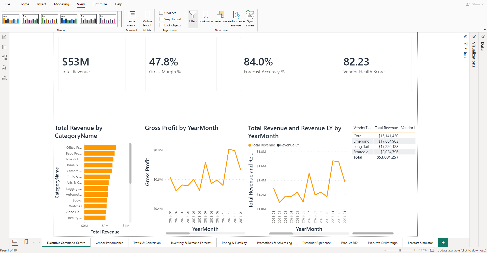
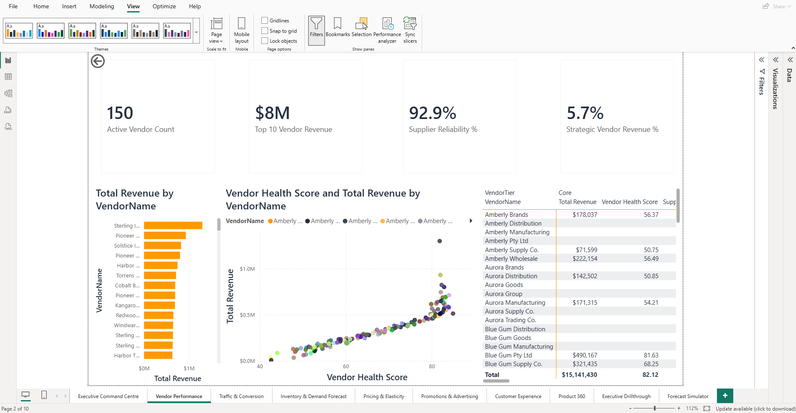
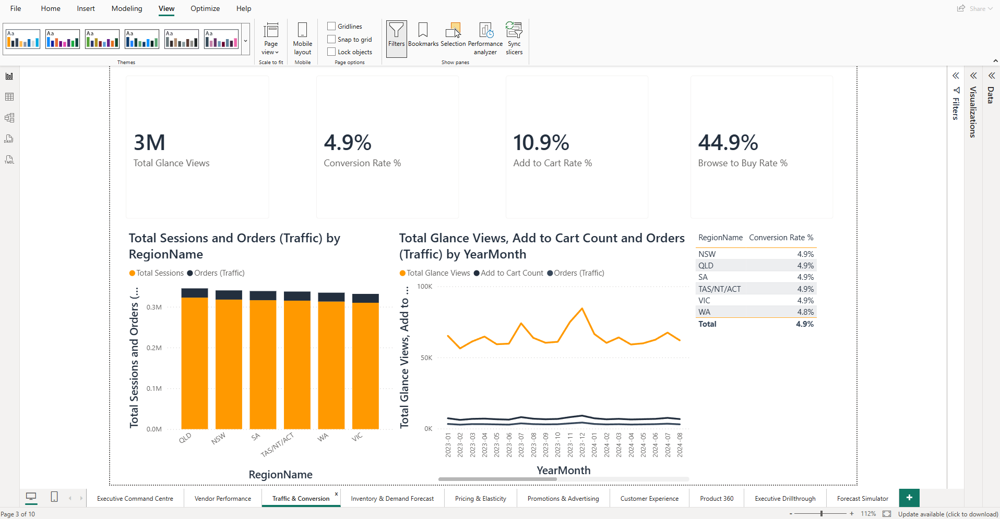
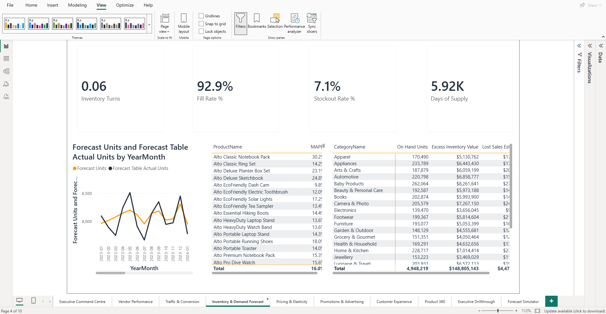
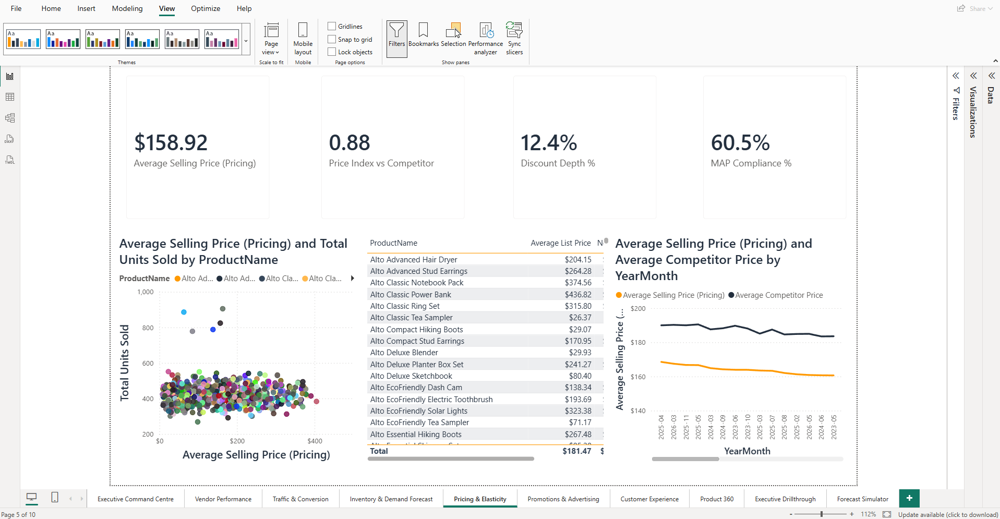
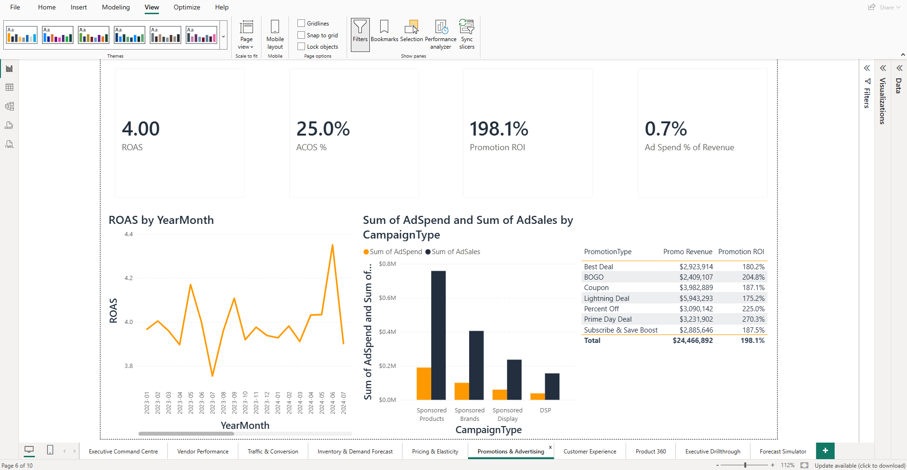
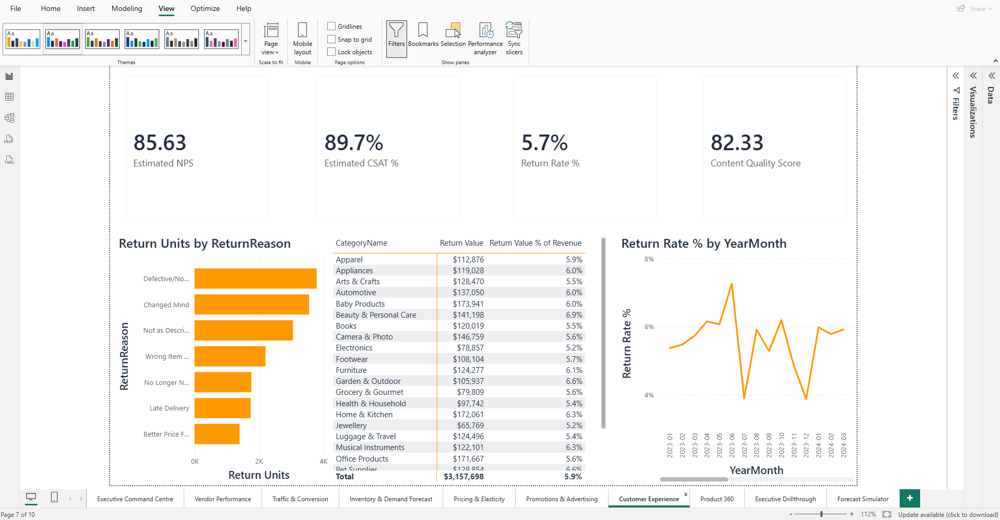
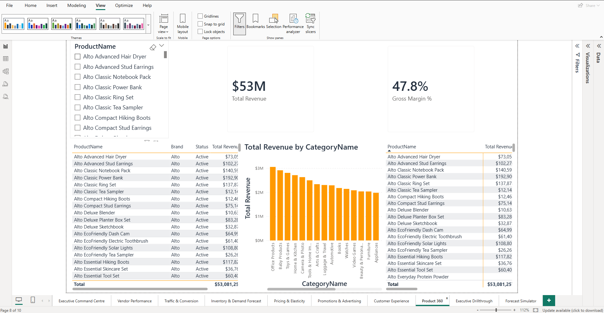
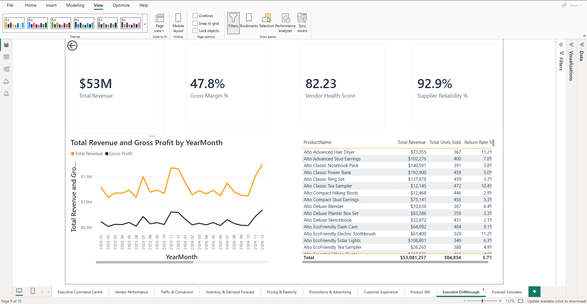
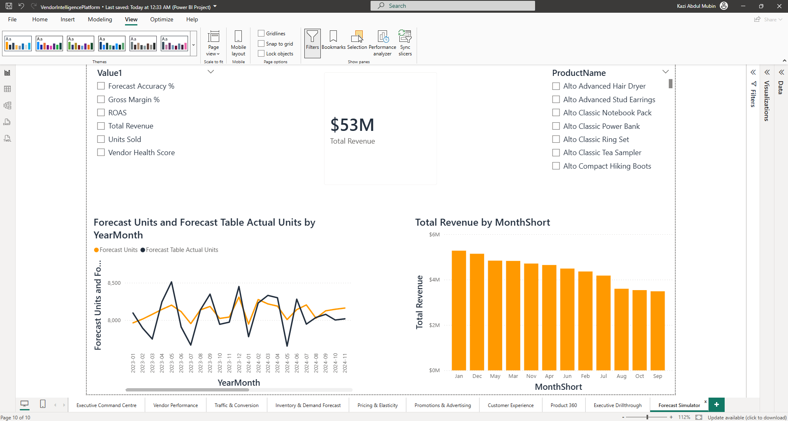

# Vendor Intelligence Platform
### Enterprise Commercial Analytics Platform — Power BI + Python

A vendor/brand analytics platform modelled on an Amazon Vendor Services-style
retail analytics team. Built as an end-to-end portfolio project: a 20-table star
schema, a 124-measure DAX library, a 10-page Power BI report, and four supporting
Python/scikit-learn models.

**Note:** the underlying dataset is synthetic (generated with Python/pandas to
mirror realistic vendor-analytics patterns — seasonality, stockouts, pricing
variance) rather than real Amazon data. Everything else — the modelling, the DAX,
the report design, the ML — was built and, where runnable, actually executed and
validated.

## Screenshots

| Executive Command Centre | Vendor Performance |
|---|---|
|  |  |

| Traffic & Conversion | Inventory & Demand Forecast |
|---|---|
|  |  |

| Pricing & Elasticity | Promotions & Advertising |
|---|---|
|  |  |

| Customer Experience | Product 360 |
|---|---|
|  |  |

| Executive Drillthrough | Forecast Simulator |
|---|---|
|  |  |

## What's in this project

**Semantic model** — 20 dimension/fact tables, 30 relationships (single active
date-filter path per fact table), 124 DAX measures organised into 12 display
folders, and a field-parameter table driving a dynamic metric selector.

**Report** — 10 pages covering executive KPIs, vendor scorecards, traffic/conversion
funnels, inventory & demand forecasting, pricing elasticity, promotions/advertising
ROI, customer experience, a product deep-dive, a drillthrough page, and a forecast
simulator.

**Machine learning** (`/ml`) — four models trained and validated against the
dataset:

| Model | Technique | Result |
|---|---|---|
| Demand forecasting | Gradient Boosting Regressor | MAE 25.8 units, MAPE 20.3% (held-out validation) |
| Inventory anomaly detection | Isolation Forest | Flagged 4.0% of inventory records |
| Vendor risk classification | Random Forest | 63% accuracy on a 38-vendor holdout |
| Market basket / cross-sell | Co-occurrence + lift analysis | 200 top product pairs from 7,269 multi-item baskets |

**Data generation** (`/scripts`) — the full pipeline that produces the dataset and
the semantic model is included, not just the output. 220,820 rows across 20 tables,
with realistic seasonality (Prime Day, Black Friday, Christmas peak).

## Tech stack

Power BI (TMDL / PBIP project format) · DAX · Power Query (M) · Python · pandas ·
scikit-learn (Gradient Boosting, Isolation Forest, Random Forest)

## Repository structure

```
vendor-intelligence-platform/
├── VendorIntelligencePlatform.pbip          # open this in Power BI Desktop
├── VendorIntelligencePlatform.SemanticModel/ # TMDL: tables, relationships, measures
├── VendorIntelligencePlatform.Report/        # PBIR: 10 pages, 67 visuals
├── data/                                     # source + ML-scored CSVs
├── scripts/                                  # data + model generation pipeline
├── ml/                                       # 4 runnable Python models
├── docs/                                     # architecture, data dictionary,
│                                              # measure catalogue, business case,
│                                              # case study, page build guide
└── screenshots/
```

## Running it yourself

1. Clone the repo
2. Open `VendorIntelligencePlatform.pbip` in Power BI Desktop
3. Update the `ProjectDataFolder` parameter (Transform data → Edit Parameters) to
   point at the `data/` folder in your local clone
4. Refresh

To run the ML models independently:
```bash
cd ml
pip install pandas numpy scikit-learn
python3 demand_forecast.py
python3 anomaly_detection.py
python3 supplier_risk_prediction.py
python3 market_basket.py
```

## Further documentation

See `/docs` for the full write-up: system architecture and design rationale, the
entity-relationship diagram, a complete data dictionary, the full measure catalogue
(all 124 measures with their DAX), Power Query documentation, and the business case
behind each report page.

---

Built by [Kazi Abdul Mubin](https://github.com/MubinMq2025)
