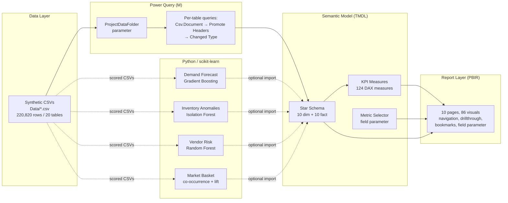

# Architecture — Vendor Intelligence Platform

## End-to-end flow

## Why this shape

**CSV + parameterised path, not embedded data.** Power Query references a single
`ProjectDataFolder` text parameter rather than hardcoded absolute paths, so the whole
project is portable — point the parameter at wherever `/Data` sits on a new machine and
every table refreshes. This is the same pattern used for productionising a Vendor
Services-style report against a real extract location (SFTP drop, data-lake export, etc.).

**TMDL over legacy `.bim`.** The semantic model is defined as folder-per-table `.tmdl`
files rather than one giant `model.bim` JSON blob, which is what Power BI Desktop
produces by default for new PBIP projects today. That also makes the model diffable and
reviewable in git — same reasoning a BI engineering team would use for source control.

**Measures isolated in a dedicated `KPI Measures` table.** No calculated columns or
measures live on the fact tables themselves. Everything analytical sits in one
table with display folders, which is the standard "clean field list" pattern reviewers
look for in a portfolio model.

**Python sits alongside, not inside, the model.** The four ML scripts
(`/ML/*.py`) run independently against the same CSVs and write scored output back to
`/Data/ML_*.csv`. Two ways to bring that into the report: (1) point a new Power Query
table at the scored CSV, or (2) use Power BI's native "Run Python script" data source
inside a query step. The scripts are kept standalone so they're inspectable and
re-runnable without opening Power BI at all — which is also how you'd want to hand a
model off to a data engineering team for scheduling.

## Known best-effort areas (read before opening in Desktop)

The semantic model (TMDL layer) follows Microsoft's documented PBIP/TMDL format and
is the most likely part of this project to open without modification. The **report
layer (PBIR JSON)** was hand-authored against the general shape of the schema without
access to Power BI Desktop to validate it — see `README.md` → "If the report layer
doesn't open cleanly" for the fastest fallback.
