# Entity-Relationship Diagram — Vendor Intelligence Platform

Star schema: every fact table relates many-to-one into shared dimensions. `DimCalendar`
is the one deliberate exception — it's kept **inactive** against `DimDate` so there's
never more than one active filter path between any fact table and the date axis
(the "no ambiguous relationships" requirement). Fiscal-calendar measures activate it
explicitly with `USERELATIONSHIP`.

```mermaid
erDiagram
    DimDate ||--o{ FactSales : "DateKey"
    DimDate ||--o{ FactInventory : "DateKey"
    DimDate ||--o{ FactTraffic : "DateKey"
    DimDate ||--o{ FactForecast : "DateKey"
    DimDate ||--o{ FactAdvertising : "DateKey"
    DimDate ||--o{ FactReturns : "DateKey"
    DimDate ||--o{ FactTargets : "DateKey"
    DimDate ||--o{ FactPricing : "DateKey"
    DimDate ||--o{ FactPromotions : "DateKey"
    DimDate ||--o{ FactAvailability : "DateKey"
    DimDate ||..o{ DimCalendar : "DateKey (inactive)"

    DimProduct ||--o{ FactSales : "ProductKey"
    DimProduct ||--o{ FactInventory : "ProductKey"
    DimProduct ||--o{ FactTraffic : "ProductKey"
    DimProduct ||--o{ FactForecast : "ProductKey"
    DimProduct ||--o{ FactAdvertising : "ProductKey"
    DimProduct ||--o{ FactReturns : "ProductKey"
    DimProduct ||--o{ FactPricing : "ProductKey"
    DimProduct ||--o{ FactPromotions : "ProductKey"
    DimProduct ||--o{ FactAvailability : "ProductKey"
    DimCategory ||--o{ DimProduct : "CategoryKey"

    DimVendor ||--o{ FactSales : "VendorKey"
    DimVendor ||--o{ FactTargets : "VendorKey"

    DimRegion ||--o{ FactSales : "RegionKey"
    DimRegion ||--o{ FactTraffic : "RegionKey"

    DimWarehouse ||--o{ FactSales : "WarehouseKey"
    DimWarehouse ||--o{ FactInventory : "WarehouseKey"
    DimWarehouse ||--o{ FactAvailability : "WarehouseKey"
    DimRegion ||--o{ DimWarehouse : "RegionKey"

    DimCustomerSegment ||--o{ FactSales : "CustomerSegmentKey"
    DimPromotion ||--o{ FactPromotions : "PromotionKey"
```

**Not shown:** `KPI Measures` and `Metric Selector` are measure-only / field-parameter
tables with no relationships — they exist purely to host the 124 DAX measures and the
dynamic metric-switching field parameter used on the Executive and Forecast Simulator
pages.

## Design notes for interview / portfolio discussion
- **Single active date path per fact table** — every fact has exactly one relationship
  to `DimDate`, which is what makes time-intelligence measures (YoY, rolling 12M, YTD)
  behave predictably without `CROSSFILTER` gymnastics.
- **`DimCalendar` inactive-by-default** is a deliberate pattern for handling retail
  4-5-4 fiscal calendars alongside a standard Gregorian date table — a real constraint
  vendor analytics teams hit when fiscal and calendar reporting diverge.
- **Bridging through `DimProduct`** for vendor attribution on inventory/traffic/pricing
  tables (rather than storing `VendorKey` redundantly on every fact) keeps the vendor
  dimension as the single source of truth for tier/segment/account-manager changes.
